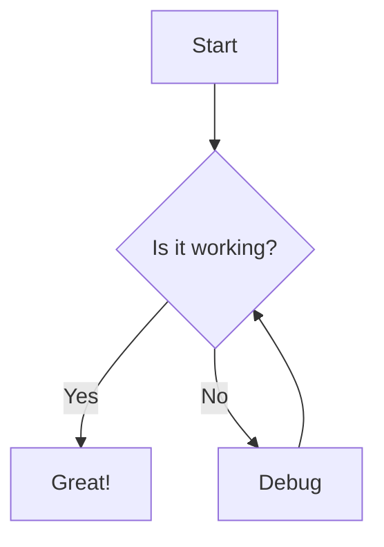
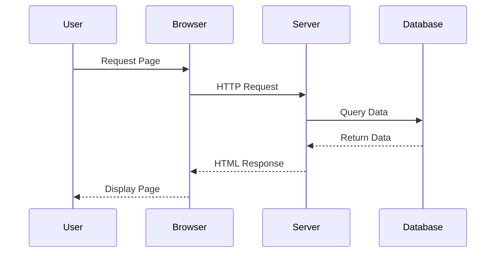
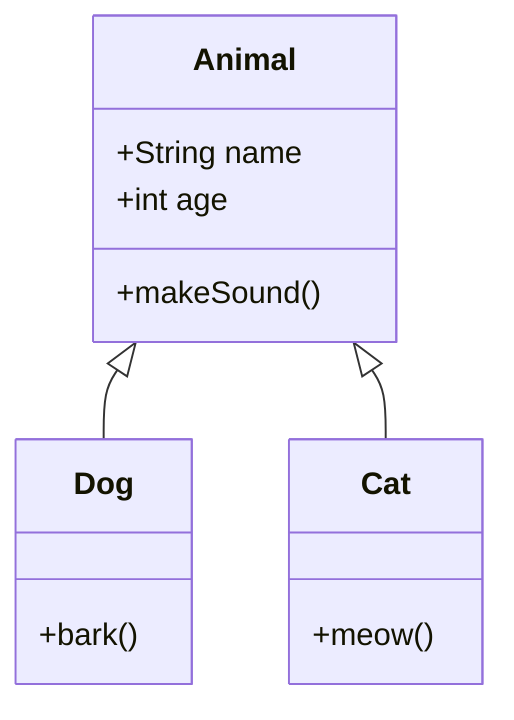
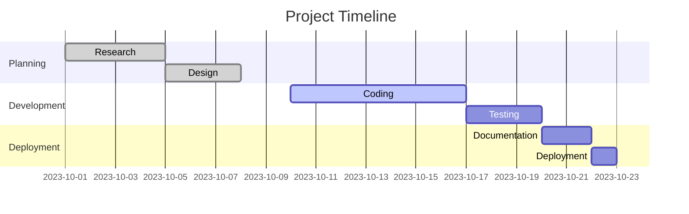
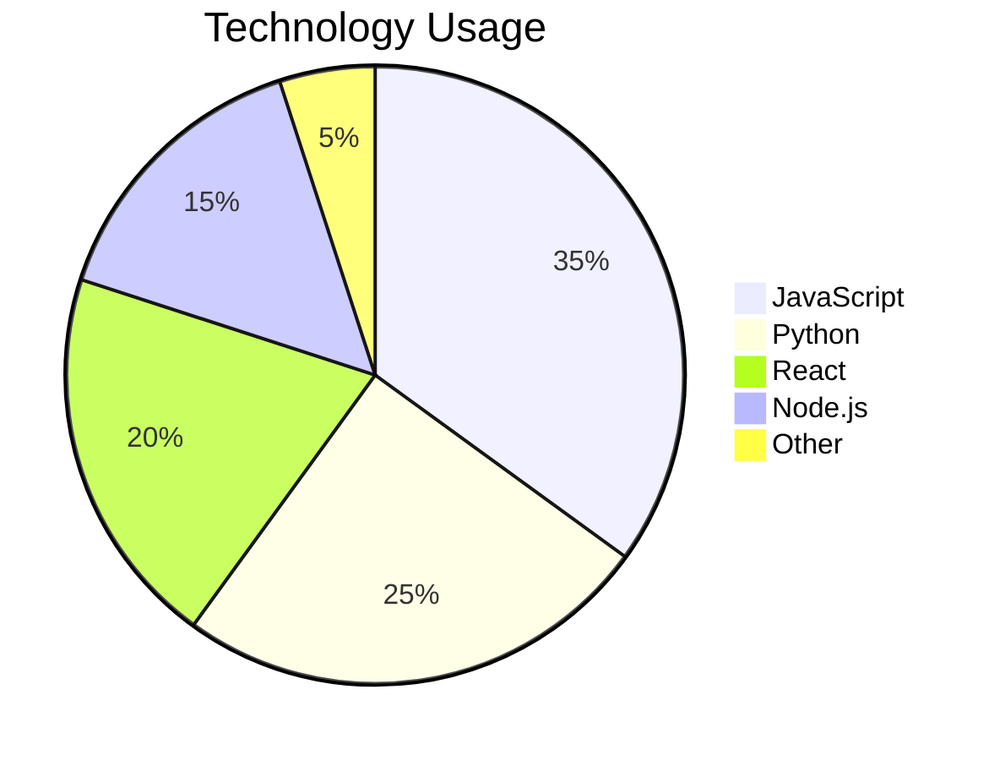

This is a test blog post to verify that Mermaid diagrams work correctly in blog posts.

## Simple Flowchart

Here's a basic flowchart:

## Sequence Diagram

Here's a sequence diagram showing the process:

## Class Diagram

Here's a simple class diagram:

## Gantt Chart

Here's a project timeline:

## Pie Chart

Here's a data visualization:

This demonstrates that various types of Mermaid diagrams should render properly in blog posts!